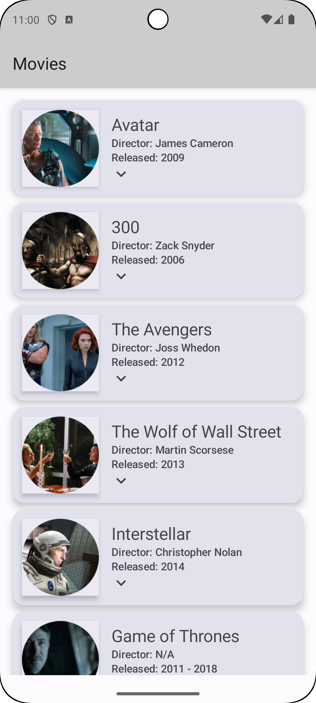
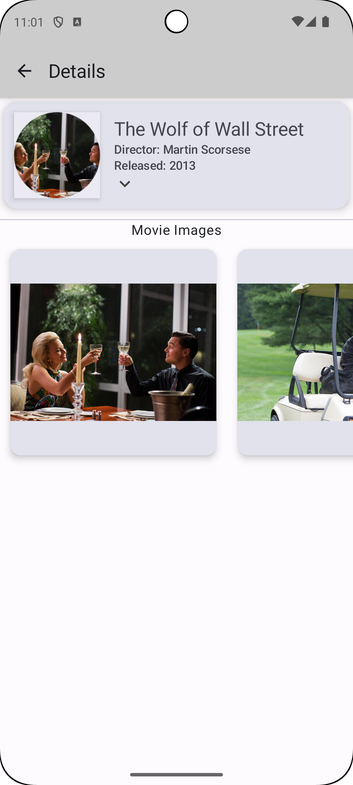
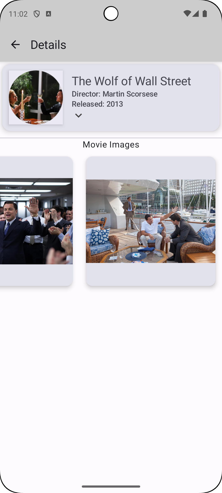

# MovieApp

- 映画リストアプリ

## 使用技術

 

## 画面仕様

 MovieScreen                                   | DetailsScreen(1/2)                         | DetailsScreen(2/2)                         
-----------------------------------------------|--------------------------------------------|--------------------------------------------
           |  |  
 アイテムタップでDetailsScreenに遷移 遷移はNavigationで行う | DetailsScreen表示時                           | 画像は横スクロール可能                                
